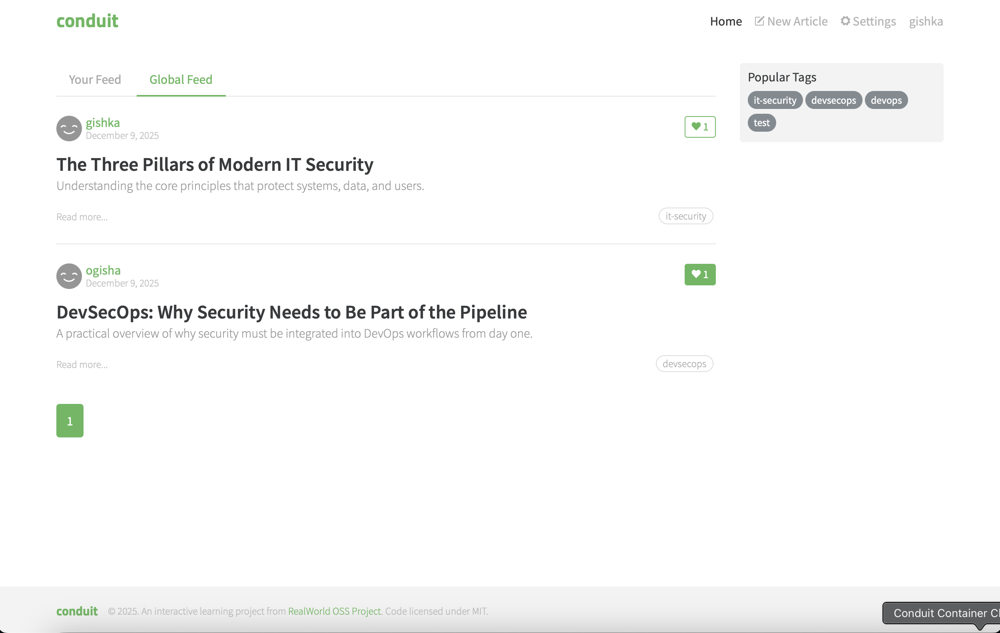

# Conduit Container

The **Conduit Container Project** showcases how to containerize a full‑stack application **Conduit RealWorld App** using Docker and Docker Compose.

This setup includes:

- A Django backend (REST API)
- An Angular frontend served via Nginx
- An SQLite database stored inside a persistent Docker volume

All configuration values are stored in environment variables and can be easily adjusted before deployment.

This project demonstrates:

- Containerization of frontend + backend  
- Multi‑stage Docker builds  
- Automated backend startup via `entrypoint.sh`  
- Persistent SQLite database volume (`db-data`)  
- Deployment to a remote Linux server  

---

## Table of Contents

- [Tech Stack](#tech-stack)
- [Project Structure](#project-structure)
- [Quickstart](#quickstart)
  - [Prerequisites](#prerequisites)
- [Deployment (Server)](#deployment-server)
- [Configuration](#configuration)
  - [Environment Variables](#environment-variables)
- [Usage](#usage)
- [Testing Checklist](#testing-checklist)
- [Security Notes](#security-notes)
- [Homepage Screenshot](#homepage-screenshot)
- [Author](#author)

---

## Tech Stack

- **Frontend:** Angular + Node.js + Nginx  
- **Backend:** Django REST Framework + Gunicorn  
- **Database:** SQLite (persisted in `/data/db.sqlite3` inside Docker volume)  
- **Containerization:** Docker + Docker Compose  

---

## Project Structure

```
conduit-container/
├─ backend/                    # Django API (Git submodule)
│  ├─ Dockerfile
│  ├─ entrypoint.sh
│  ├─ requirements.txt
│  └─ ...
├─ frontend/                   # Angular Application (Git submodule)
│  ├─ Dockerfile
│  ├─ .dockerignore
│  └─ ...
├─ docs/
│  ├─ images/
│  │  └─ homepage.png
│  └─Conduit_Container_Checkliste
├─ docker-compose.yaml
├─ example.env
├─ .gitignore
└─ README.md
```

---

## Quickstart

### Prerequisites

Check Docker:

```bash
docker --version
```

Check Docker Compose:

```bash
docker compose version
```

Check Git:

```bash
git --version
```

---

## Deployment (Server)

### 1. Connect to your server

```bash
ssh <username>@<server-ip>
```

### 2. Clone and enter the repository

```bash
git clone --recursive https://github.com/ognjenmanojlovic/conduit-container.git
```

```bash
cd conduit-container
```

### 3. Update all submodules

```bash
git submodule update --init --recursive
```

### 4. Prepare environment variables

```bash
cp example.env .env
```

Edit `.env` and configure:

- Backend port  
- Frontend port  
- **Django allowed hosts (your server IP must be included!)**  
- Django superuser values  
- SQLite DB path (default: `/data/db.sqlite3`)  

### 5. Build Docker images

```bash
docker compose build
```

### 6. Start the application

```bash
docker compose up -d
```

### 7. Access in browser

Frontend:

```
http://<server-ip>:8282
```

Backend API:

```
http://<server-ip>:8000/api/articles/
```

Django Admin:

```
http://<server-ip>:8000/admin/
```

### 8. Persistence Test

```bash
docker compose down
```

```bash
docker compose up -d
```

Your created users, articles, and comments should still exist, because SQLite is stored in the persistent Docker volume `db-data`.

---

## Configuration

All configuration is done via `.env`.

### Environment Variables

```env
# Ports
FRONTEND_PORT=8282
BACKEND_PORT=8000

# Django allowed hosts (must include your server IP)
DJANGO_ALLOWED_HOSTS=localhost,127.0.0.1,<your.server.ip>

# SQLite DB Path (persistent)
DJANGO_DB_PATH=/data/db.sqlite3

# Django Superuser (created automatically on first run)
DJANGO_SUPERUSER_USERNAME=admin
DJANGO_SUPERUSER_EMAIL=admin@example.com
DJANGO_SUPERUSER_PASSWORD=change_me_admin_pass
```

---

## Usage

### Start stack

```bash
docker compose up -d
```

### Stop stack

```bash
docker compose down
```

### Backend logs

```bash
docker compose logs backend
```

### Frontend logs

```bash
docker compose logs frontend
```

### Access Django admin panel

```
http://<server-ip>:8000/admin/
```

---

## Testing Checklist

- [x] Frontend container builds successfully  
- [x] Backend container builds successfully  
- [x] SQLite database stored in persistent Docker volume  
- [x] Backend reachable via `<server-ip>:8000/api/...`  
- [x] Frontend reachable via `<server-ip>:8282`  
- [x] Django admin login works  
- [x] Environment variables loaded correctly  
- [x] Application persists data across restarts  
- [x] `.env` excluded from Git  

---

## Security Notes

- `.env` must **never** be committed  
- Always use strong, unique passwords  
- Do not expose unnecessary ports  
- Keep dependencies updated  
- Ensure allowed hosts are set correctly  

---

## Homepage Screenshot

Below is a screenshot of the Conduit application's homepage as part of the deployment validation.



---

## Author

**Ognjen Manojlovic**

- Instagram: https://instagram.com/0gisha  
- LinkedIn: https://www.linkedin.com/in/ognjen-manojlovic